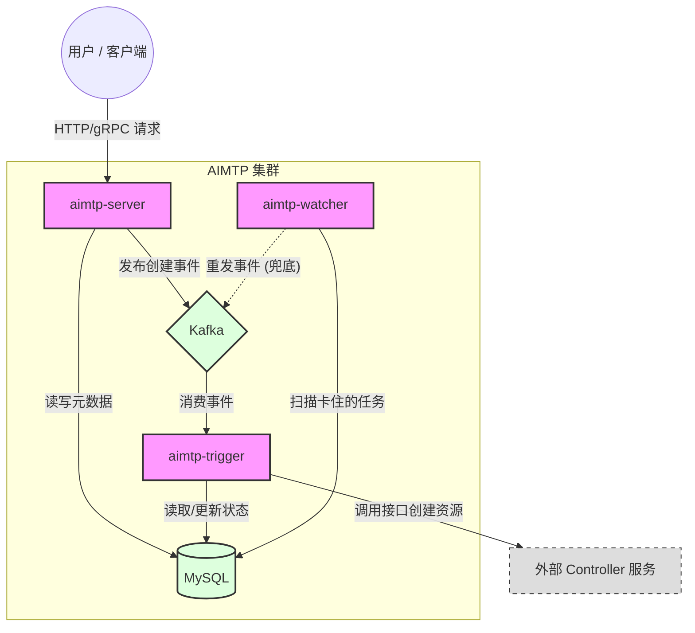

# AIMTP 系统组件架构图

## 高层架构概览 (High-Level Overview)

本图展示了 AIMTP 系统中核心组件的静态关系与职责划分。

## 组件职责说明

| 组件名称 | 核心职责 | 伸缩性 | 部署形态 |
| :--- | :--- | :--- | :--- |
| **aimtp-server** | **API 网关与业务入口**。处理用户请求，校验参数，快速落库（Pending 态）并返回。 | 水平扩展 (无状态) | Deployment |
| **aimtp-trigger** | **异步触发器**。消费 Kafka 队列中的任务，根据任务信息调用下游 Controller，真正触发 K8s 资源创建。 | 水平扩展 (无状态) | Deployment |
| **aimtp-watcher** | **可靠性守护者**。定期扫描数据库，发现并恢复因系统故障导致“丢失”或“卡住”的任务。 | 单例 (主备模式) | CronJob |
| **MySQL** | **状态存储**。DAG 元数据与状态流转的唯一事实来源 (Source of Truth)。 | 垂直扩展 / HA 集群 | StatefulSet / RDS |
| **Kafka** | **事件总线**。解耦 API 与后台处理逻辑，削峰填谷，缓冲瞬时流量。 | 水平扩展 | StatefulSet / MSK |

## 关于组件命名的思考

### 为什么叫 `aimtp-trigger` 而不是 `scheduler`？
*   **Trigger (触发器)**：它的核心动作是 **“拿单 -> 派单”**。它本身并不负责复杂的资源调度算法（比如“这个任务该跑在哪个节点上”），那是 K8s Scheduler 或下游 Controller 的职责。它只是负责 **“触发”** 创建流程。
*   **Scheduler (调度器)**：通常暗示有复杂的资源分配、优先级队列、抢占逻辑（如 K8s Scheduler, YARN Scheduler）。如果我们只是做简单的异步转发调用，叫 Scheduler 会让人误以为它很重。
*   **Worker (工人)**：通常指真正干活（跑训练代码）的 Pod。为了避免和实际的 AI Worker 混淆，也不建议叫 Worker。

因此，**Trigger**（触发器）或者 **Dispatcher**（分发器）是更精准的描述。这里我们选用 **Trigger**，意为“触发 DAG 执行流程”。
